[](#install)
[](.github/workflows/self-test.yml)
[](LICENSE)
[](PRIVACY.md)

**[Install](#install)** · **[What you get](#what-you-get)** · **[The script](#the-script)** · **[Privacy](#privacy)** · **[The Cairn family](#the-cairn-family)**

**Claude forgets everything between sessions, so it re-reads, re-researches and re-decides.
Cairn Memory gives every fact one right place and keeps it from going stale.**

A cairn is a stack of stones left to guide whoever comes next. This is the same idea for
your next Claude Code session.

Most memory setups fail in one of three ways:

- **Too expensive.** Everything goes into `CLAUDE.md` or the memory index, and it loads
  in every session whether it's needed or not. One real memory index was costing about
  2,500 tokens per session before the first message was typed.
- **Quietly false.** A note that was true in June says "next: build X" in September,
  after X was built. Four memories each claim to be "the current direction". Claude
  picks one and confidently redoes work that is already closed.
- **Written down, never enforced.** "Never touch `billing/`" sits in a file Claude only
  reads once it opens a billing file, which is after it has planned the change. A written
  rule is advice. Only a check that fails holds it.

Cairn Memory is a skill for Claude Code. It fixes the first two, shows you which rules
need a check for the third, and gives you a script that proves the fix holds:



*Real output, from a small made-up memory folder.*

## Who it's for

If you built your product with Claude Code, Cursor, Codex, or several of them over a few
months, you have probably seen these problems:

- It undoes a fix you made last week.
- It re-proposes an idea you already rejected.
- It breaks a rule you wrote down, because the rule was in a file it hadn't read yet.
- Each tool follows different rules, because each one reads a different file.
- Every session starts by re-reading everything, and your usage limit goes faster than the
  work.

None of this means the AI is getting worse. It means your project's memory is scattered,
stale or in the wrong place. Cairn Memory gives every agent **one shared memory**:
`AGENTS.md` is read by Claude Code, Cursor and Codex. Some layers are Claude Code's
alone, such as `.claude/rules` and folder `CLAUDE.md` files. So a rule that matters gets
one line in `AGENTS.md` as well, and a CI check or git hook that stops every agent. It
also records what has already been decided, so settled questions stay settled.

You don't need to know where any of these files live. Ask in plain words:

- *"Why does Claude keep redoing things we already decided?"*
- *"Set up memory for this project so every AI tool follows the same rules."*
- *"Check my project's memory and score it 0–10."*

## What you get


| | |
|---|---|
| **Fewer tokens per session** | Budgets for everything that loads every session, and what to move out. It covers the load cap on `MEMORY.md`: only the first 200 lines or 25KB are read, and the rest is invisible. |
| **Claude stops redoing research** | Registries for evidence you've already gathered, one-line "read this first" pointers, and a closed-questions ledger, so settled questions stay settled. |
| **Memory that doesn't mislead** | Every file path an agent is told to follow must exist, no memory hides outside the index, and there is exactly one current direction. The script catches these signs of staleness. Whether a note is still *true* is something only the code can say, so the skill tells Claude to check a memory against the code before acting on it. Each rule comes from a real incident. |
| **A clear answer to "where does this go?"** | A routing table for every layer: global and project `CLAUDE.md`, `AGENTS.md`, `CLAUDE.local.md`, folder files, path-scoped `.claude/rules`, auto memory, repo docs, generated status files, recall tools, and deny rules, hooks and CI. It covers when each one loads and what that costs. |
| **Rules that can't be skipped** | Which rules to write down, which to enforce with a permission deny rule, hook or CI step, and why a folder `CLAUDE.md` alone won't stop Claude creating a new file in a frozen folder. In a binding file, each rule says what enforces it, and the audit flags one that doesn't. |
| **Skills and agent files that don't ship broken** | Links inside a skill's own folder must resolve. Agents, commands and skills under `.claude/` are checked too, and `--census` shows which files the check covers. |
| **A score you can defend** | A 0–10 rubric where every point cites evidence, and things it couldn't see are marked N/A rather than scored 0. |

## How it compares

| Need | Use |
|---|---|
| Better-written `CLAUDE.md` files: commands, architecture notes, gotchas, session learnings | Anthropic's [`claude-md-management`](https://claude.com/plugins/claude-md-management) |
| Recall of past sessions by search | a memory or transcript-search plugin |
| **Where each fact belongs across the whole memory system, and whether it's still true** | **Cairn Memory** |
| Whether a change the AI made actually works | [Cairn Verify](https://github.com/nicuk/did-ai-really-fix-it) |

`claude-md-management` makes your `CLAUDE.md` files better written. Cairn Memory works a
level above that: it decides **where** each fact should live, moves out what doesn't
belong, and catches memory that has gone stale. They work well together.

Cairn Memory doesn't review your code, plan changes or judge whether a fix works. It makes
sure the instructions and memory every session starts from are cheap to load, point at
things that exist, and are enforced where it matters.

## Install

```
/plugin marketplace add nicuk/claude-md-memory-architecture
/plugin install cairn-memory@cairn-memory
```

Then ask in plain words: *"audit my Claude memory and score it 0–10"*, *"where should
this rule live?"*, *"set up CLAUDE.md for this new repo"*, or *"Claude keeps redoing the
same research"*.

## The script

`skills/memory-architecture/scripts/audit_memory.py` runs 25 checks that give the same
answer every time. Examples: an index past its load cap, memories missing from the
index, one file indexed twice, several files each claiming to be the current direction,
backticked paths, `@` imports and links that don't exist, `.claude/rules` globs that match
nothing, a skill whose links into its own folder are dead, a binding rule that names no
enforcer, and project-specific lines in your global file.

From your project's folder, one command audits the repo, the memory Claude Code keeps for
it and your global `CLAUDE.md`. It finds the memory folder itself, including from a
worktree, and says so if Claude Code hasn't saved any memory for the project yet:

```
python skills/memory-architecture/scripts/audit_memory.py --project .
```

Or name each part yourself, and see the other options:

```
python skills/memory-architecture/scripts/audit_memory.py --repo . \
  --memory-dir <memory folder> --global-file ~/.claude/CLAUDE.md
python skills/memory-architecture/scripts/audit_memory.py --repo . --census
python skills/memory-architecture/scripts/audit_memory.py --self-test
```

Add `--strict` in CI to fail on warnings as well as failures, once a repo has cleared them.
`--census` lists every markdown file in the repo and how the check covers it, so nothing
is left out without you seeing it.

`--self-test` plants one defect for each check in a temporary folder and confirms every
check fires. It reads the list of checks from the script itself, so a new check without
a planted defect fails it. A check that has never failed has never been tested. It also plants the
false alarms that real repositories produced, such as brace globs, gitignored build
output and placeholders like `OUT_DIR`, and confirms each one stays quiet or only warns.
The self-test badge at the top runs it on every push. The same run reads the script's
code to prove it stays read-only and offline, and checks that the numbers this README
states match their source.

If your memory index is over budget, `--draft-index` proposes a trimmed one. It writes
`MEMORY.draft.md` next to your index, with one short line per memory and none lost, and
prints the size before and after. It never changes `MEMORY.md`: you read the draft and
swap it in yourself.

```
python skills/memory-architecture/scripts/audit_memory.py --draft-index --project .
```

## What it runs, and what it doesn't

- It reads only the paths you pass it, and runs `git ls-files` and `git check-ignore` in
  `--repo` to see what is tracked and what is ignored. With `--project` it also lists the
  folder names in `~/.claude/projects` to find your project's memory, and reads your global
  `~/.claude/CLAUDE.md`.
- It writes nothing, with two exceptions: `--self-test` writes a temporary folder (with a
  throwaway git repository in it) and deletes it, and `--draft-index` writes one file,
  `MEMORY.draft.md`, in the memory folder you name. It never overwrites `MEMORY.md`.
- It makes no network calls, and there's no server or API key. Nothing leaves your
  machine. On every push, `.github/scripts/check_privacy.py` reads the script's code to
  prove it: no import that can reach the network, no program except read-only git, and no
  writes outside the two exceptions above.
- Everything else is instructions for Claude in `SKILL.md` and `references/`.

## Evidence

**Case study:** [The memory index that cost 2,500 tokens a session, and hid an "active" plan](https://github.com/nicuk/cairn-principles/blob/main/case-studies/memory-index-that-cost-every-session.md).

The rules come from about fifteen repositories worked with coding agents between June
and September 2026. Every rule has an incident behind it, recorded in
`skills/memory-architecture/references/incidents.md`.

In a small test (two realistic prompts, one run each with and without the skill), answers
with the skill passed 93% of the checks against 71% without. Treat that as indicative,
not conclusive: the same author wrote and graded it, and one assertion was reworded
afterwards (see `evals/README.md`). The checks target Claude Code's file layout. The `AGENTS.md` rules also
apply to other agents that read `AGENTS.md`.

## Privacy

Nothing is collected. See [PRIVACY.md](PRIVACY.md).

## The Cairn family

Three plugins built on one principle: **a claim with an enforcer stays true; a claim with
only an author rots.** Each one checks a different kind of claim.
[The principles, the evidence and the design decisions](https://github.com/nicuk/cairn-principles) are
in one place.

| Plugin | The question it answers |
|---|---|
| **Cairn Memory** (this one) | Is what your agents remember cheap to load, and still true? |
| [Cairn Signals](https://github.com/nicuk/llm-silent-failure-audit) | Are the numbers your AI product shows real? |
| [Cairn Verify](https://github.com/nicuk/did-ai-really-fix-it) | Did the AI really fix it? |

## Who made this

Built by [Nic Chin](https://nicchin.com/?ref=cairn-memory), who reviews apps built with AI
coding tools. If this audit showed that your agents have been working from stale or
conflicting instructions, the code they wrote may deserve the same check. That's what the
[AI-Built App Audit](https://nicchin.com/vibe-coded-app-audit?ref=cairn-memory) is for.
The plugin is free and complete either way. Nothing in it is held back.

## License

MIT
